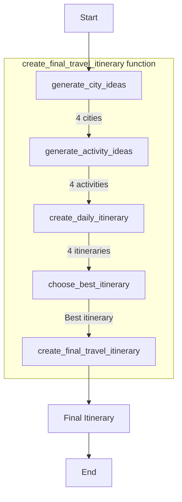

# Travel Planner AI

This project uses AI to generate personalized travel itineraries using the `ell` library and various GPT models.

## Quick Start

Use the following Makefile commands to interact with the project:

```sh
make run      # Run the main Python script
make black    # Format the Python code using Black
make ell      # Run the ELL studio with the logs storage
make aider    # Run the Aider chat tool
make a        # Shorthand for 'make aider'
```

## Project Structure

- `hello.py`: Main Python script for AI-powered travel planning
- `Makefile`: Contains commands for running and maintaining the project

## How It Works

The main script (`hello.py`) performs the following steps:

1. Generates random city ideas
2. Suggests activities for each city
3. Creates 3-day itineraries
4. Selects the best itinerary
5. Refines and formats the final travel itinerary

### Mermaid



## Requirements

- `uv` for Python package management
- OpenAI API key (set as an environment variable)
